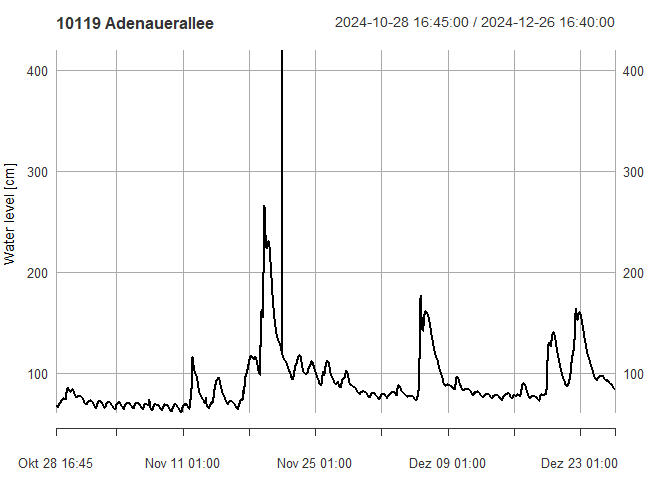

<!-- README.md is generated from README.Rmd. Please edit that file -->

# EGLVgauges

<!-- badges: start -->
<!-- badges: end -->

vg250 aims to grant easy access to EGLV gauge data published at
pegel.eglv.de.

## Installation

You can install the development version of EGLVgauges with:

``` r
# install.packages("devtools")
devtools::install_github("dimfalk/EGLVgauges")
```

## Basic examples

Just a few quick insights on the use of this package:

``` r
library(EGLVgauges)
#> 0.1.12

# fetch all available gauges
gauges <- get_gauges()
gauges
#> Simple feature collection with 112 features and 12 fields
#> Geometry type: POINT
#> Dimension:     XY
#> Bounding box:  xmin: 336929 ymin: 5701285 xmax: 433191 ymax: 5733623
#> Projected CRS: ETRS89 / UTM zone 32N
#> # A tibble: 112 × 13
#>    id    name                     waterbody current_trend has_current_waterlevel
#>    <chr> <chr>                    <chr>     <chr>         <lgl>                 
#>  1 10104 Econova Allee            Berne     Keine Daten   TRUE                  
#>  2 10135 E Posener Straße (neu)   Borbecke… Keine Daten   TRUE                  
#>  3 11038 HRB Borbecker MB, Ablau… Borbecke… Keine Daten   TRUE                  
#>  4 12036 HRB Borbecker Mühlenbac… Borbecke… Keine Daten   TRUE                  
#>  5 10085 Nöggerathstraße          Borbecke… Keine Daten   TRUE                  
#>  6 10140 BOT Gungstraße, Fußgäng… Boye      Keine Daten   TRUE                  
#>  7 10141 Braukstraße, B224        Boye      Keine Daten   TRUE                  
#>  8 10139 GLA Brücke Welheimer St… Boye      Keine Daten   TRUE                  
#>  9 22049 An den Höfen, Hünxe (HR… Bruckhau… Kein Trend    TRUE                  
#> 10 21119 HÜN HRB Zur alten Mühle… Bruckhau… Keine Daten   TRUE                  
#> # ℹ 102 more rows
#> # ℹ 8 more variables: latest_waterlevel_datetime <dttm>,
#> #   latest_waterlevel_value <dbl>, latest_waterlevel_current_alertlevel <int>,
#> #   has_current_discharge <lgl>, latest_discharge_datetime <dttm>,
#> #   latest_discharge_value <dbl>, latest_discharge_current_alertlevel <lgl>,
#> #   geometry <POINT [m]>

# eventually filter the dataset to the ones you're interested in
gauge <- gauges |> dplyr::filter(id == "10119")
gauge
#> Simple feature collection with 1 feature and 12 fields
#> Geometry type: POINT
#> Dimension:     XY
#> Bounding box:  xmin: 367059.8 ymin: 5712147 xmax: 367059.8 ymax: 5712147
#> Projected CRS: ETRS89 / UTM zone 32N
#> # A tibble: 1 × 13
#>   id    name          waterbody current_trend has_current_waterlevel
#> * <chr> <chr>         <chr>     <chr>         <lgl>                 
#> 1 10119 Adenauerallee Emscher   Keine Daten   TRUE                  
#> # ℹ 8 more variables: latest_waterlevel_datetime <dttm>,
#> #   latest_waterlevel_value <dbl>, latest_waterlevel_current_alertlevel <int>,
#> #   has_current_discharge <lgl>, latest_discharge_datetime <dttm>,
#> #   latest_discharge_value <dbl>, latest_discharge_current_alertlevel <lgl>,
#> #   geometry <POINT [m]>


# fetch waterlevel measurements
meas <- get_measurements(gauge)[[1]]
meas
#> Warning: object timezone ('etc/GMT-1') is different from system timezone ('')
#>   NOTE: set 'options(xts_check_TZ = FALSE)' to disable this warning
#>     This note is displayed once per session
#>                     waterlevel
#> 2024-09-30 09:55:00         81
#> 2024-09-30 10:00:00         81
#> 2024-09-30 10:05:00         81
#> 2024-09-30 10:10:00         81
#> 2024-09-30 10:15:00         81
#> 2024-09-30 10:20:00         81
#> 2024-09-30 10:25:00         81
#> 2024-09-30 10:30:00         81
#> 2024-09-30 10:35:00         81
#> 2024-09-30 10:40:00         81
#>                 ...           
#> 2024-11-28 09:05:00        102
#> 2024-11-28 09:10:00        102
#> 2024-11-28 09:15:00        102
#> 2024-11-28 09:20:00        102
#> 2024-11-28 09:25:00        102
#> 2024-11-28 09:30:00        102
#> 2024-11-28 09:35:00        102
#> 2024-11-28 09:40:00        102
#> 2024-11-28 09:45:00        102
#> 2024-11-28 09:50:00        102

class(meas)
#> [1] "xts" "zoo"

plot(meas, main = "10119 Adenauerallee", ylab = "Water level [cm]")
```



``` r


# fetch metadata available
get_meta(gauge)
#> # A tibble: 1 × 9
#>   id    name        waterbody municipality      X      Y river_km catchment_area
#>   <chr> <chr>       <chr>     <chr>         <dbl>  <dbl>    <dbl>          <dbl>
#> 1 10119 Adenaueral… Emscher   Gelsenkirch… 3.67e5 5.71e6     36.4           481.
#> # ℹ 1 more variable: level_zero <dbl>
```
