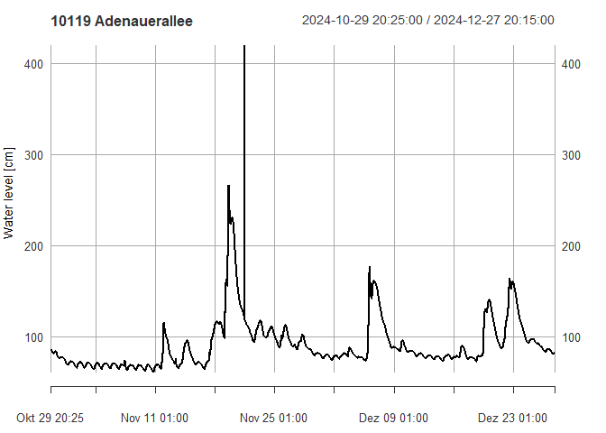

<!-- README.md is generated from README.Rmd. Please edit that file -->

# NRWgauges

<!-- badges: start -->

[](https://github.com/dimfalk/NRWgauges/actions/workflows/R-CMD-check.yaml)
[](https://codecov.io/gh/dimfalk/NRWgauges)
<!-- badges: end -->

NRWgauges aims to grant easy access to gauge (meta-)data published on
distributed web-based platforms by various water management associations
in North Rhine-Westphalia, Germany.

As of today, the following platforms can be harvested:

- pegel.eglv.de (Emschergenossenschaft / Lippeverband)

## Installation

You can install the development version of NRWgauges with:

``` r
# install.packages("devtools")
devtools::install_github("dimfalk/NRWgauges")
```

and load the package via

``` r
library(NRWgauges)
#> 0.3.0
```

## Basic example: EGLV

### Get gauge metadata, locations and latest measurements

``` r
# fetch all available gauges
gauges <- get_eglv_gauges()
gauges
#> Simple feature collection with 112 features and 12 fields
#> Geometry type: POINT
#> Dimension:     XY
#> Bounding box:  xmin: 336929 ymin: 5701285 xmax: 433191 ymax: 5733623
#> Projected CRS: ETRS89 / UTM zone 32N
#> # A tibble: 112 × 13
#>    id    name                     waterbody current_trend has_current_waterlevel
#>    <chr> <chr>                    <chr>     <chr>         <lgl>                 
#>  1 10104 Econova Allee            Berne     Keine Daten   TRUE                  
#>  2 10135 E Posener Straße (neu)   Borbecke… Keine Daten   TRUE                  
#>  3 11038 HRB Borbecker MB, Ablau… Borbecke… Keine Daten   TRUE                  
#>  4 12036 HRB Borbecker Mühlenbac… Borbecke… Keine Daten   TRUE                  
#>  5 10085 Nöggerathstraße          Borbecke… Keine Daten   TRUE                  
#>  6 10140 BOT Gungstraße, Fußgäng… Boye      Keine Daten   TRUE                  
#>  7 10141 Braukstraße, B224        Boye      Keine Daten   FALSE                 
#>  8 10139 GLA Brücke Welheimer St… Boye      Keine Daten   TRUE                  
#>  9 22049 An den Höfen, Hünxe (HR… Bruckhau… Kein Trend    TRUE                  
#> 10 21119 HÜN HRB Zur alten Mühle… Bruckhau… Keine Daten   TRUE                  
#> # ℹ 102 more rows
#> # ℹ 8 more variables: latest_waterlevel_datetime <dttm>,
#> #   latest_waterlevel_value <dbl>, latest_waterlevel_current_alertlevel <int>,
#> #   has_current_discharge <lgl>, latest_discharge_datetime <dttm>,
#> #   latest_discharge_value <dbl>, latest_discharge_current_alertlevel <lgl>,
#> #   geometry <POINT [m]>

# ... eventually filter the dataset to the objects you're interested in
gauge <- gauges |> dplyr::filter(id == "10119")
gauge
#> Simple feature collection with 1 feature and 12 fields
#> Geometry type: POINT
#> Dimension:     XY
#> Bounding box:  xmin: 367059.8 ymin: 5712147 xmax: 367059.8 ymax: 5712147
#> Projected CRS: ETRS89 / UTM zone 32N
#> # A tibble: 1 × 13
#>   id    name          waterbody current_trend has_current_waterlevel
#> * <chr> <chr>         <chr>     <chr>         <lgl>                 
#> 1 10119 Adenauerallee Emscher   Keine Daten   TRUE                  
#> # ℹ 8 more variables: latest_waterlevel_datetime <dttm>,
#> #   latest_waterlevel_value <dbl>, latest_waterlevel_current_alertlevel <int>,
#> #   has_current_discharge <lgl>, latest_discharge_datetime <dttm>,
#> #   latest_discharge_value <dbl>, latest_discharge_current_alertlevel <lgl>,
#> #   geometry <POINT [m]>
```

### Get (extended) metadata for selected gauges

``` r
get_eglv_meta(gauge)
#> # A tibble: 1 × 9
#>   id    name        waterbody municipality      X      Y river_km catchment_area
#>   <chr> <chr>       <chr>     <chr>         <dbl>  <dbl>    <dbl>          <dbl>
#> 1 10119 Adenaueral… Emscher   Gelsenkirch… 3.67e5 5.71e6     36.4           481.
#> # ℹ 1 more variable: level_zero <dbl>
```

### Get available measurements for selected gauges

``` r
# fetch water level measurements
meas <- get_eglv_measurements(gauge)[[1]]
meas
#> Warning: object timezone ('etc/GMT-1') is different from system timezone ('')
#>   NOTE: set 'options(xts_check_TZ = FALSE)' to disable this warning
#>     This note is displayed once per session
#>                     Wasserstand
#> 2024-10-29 12:20:00          75
#> 2024-10-29 12:25:00          75
#> 2024-10-29 12:30:00          75
#> 2024-10-29 12:35:00          75
#> 2024-10-29 12:40:00          75
#> 2024-10-29 12:45:00          75
#> 2024-10-29 12:50:00          75
#> 2024-10-29 12:55:00          75
#> 2024-10-29 13:00:00          75
#> 2024-10-29 13:05:00          75
#>                 ...            
#> 2024-12-27 11:25:00          85
#> 2024-12-27 11:30:00          85
#> 2024-12-27 11:35:00          84
#> 2024-12-27 11:40:00          84
#> 2024-12-27 11:45:00          84
#> 2024-12-27 11:50:00          84
#> 2024-12-27 11:55:00          84
#> 2024-12-27 12:00:00          84
#> 2024-12-27 12:05:00          84
#> 2024-12-27 12:10:00          84

class(meas)
#> [1] "xts" "zoo"

plot(meas, main = "10119 Adenauerallee", ylab = "Water level [cm]")
```


